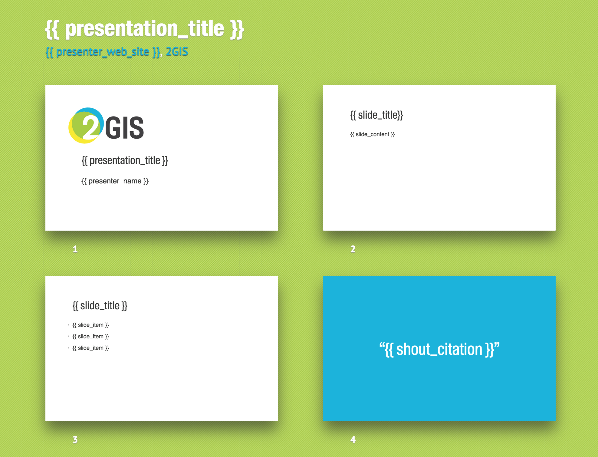

# Корпоративная тема 2GIS для Shower HTML presentation engine

[Демо сайт](http://shwr.me/) презентационного движка.

Скриншот 2ГИС темы 

## Зачем мне это?

* Избавление от вендора презентационного софта
* Удобное для программистов редактирование презентации в любимом тексотовом редакторе
* Красиво, из коробки
* Кроссплатформено, работает нормальном браузере на любой ОС, не страшно что что-то "поедет"
* Нет завязки на сетевое соединение

## Порядок действий

* Делаем fork репозитория
* Делаем презентацию (редактируем index.html, картинки и тд)

### Смотрим в действии

- Открываем в браузере index.html
- Видим всю презентацию
- Кликаем на любой слайд и входим в presentation mode
- Навигируемся стрелками клавиатуры
- Жмем `Esc` для выхода из presentation mode

Читаем [Wiki](https://github.com/shower/shower/wiki) если возникли вопросы.

## Установка зависимостей

### Ubuntu

Ставим пакет nodejs

```sh
sudo apt-get install nodejs nodejs-legacy
```

Устанавливаем node пакеты
```sh
# папка с проектом
npm install
```

### OSX

Ставим [homebrew](http://brew.sh/)

```sh
ruby -e "$(curl -fsSL https://raw.githubusercontent.com/Homebrew/install/master/install)"
```

Добавляем директории homebrew в переменную окружения PATH
```sh
echo 'export PATH="/usr/local/bin:$PATH"' >> ~/.bash_profile
```

Ставим пакет nodejs

```sh
brew install node
```

Устанавливаем node пакеты
```sh
# папка с проектом
npm install
```

## Экспорт

### HTML

```sh
npm install -g grunt-cli
```

Далее смотрим на доступные задачи для Grunt

```sh
grunt --help
```

Для экспорта и создания архива используем `grunt archive`. Для экспорта в папку используем `grunt export`.

### PDF

Экспорта в PDF нет из коробки, тк это HTML presentation engine :)
